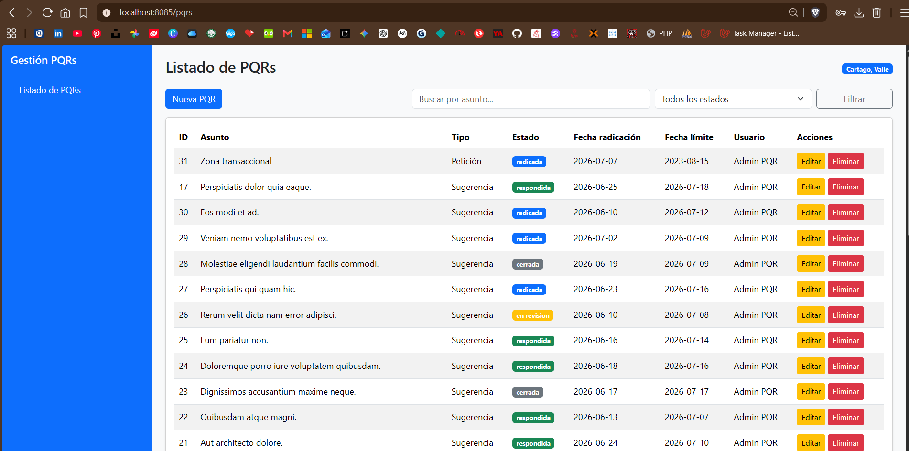

# Gestión de PQRs para Conjuntos Residenciales

Proyecto desarrollado con Laravel 13 y MySQL como aplicación del proyecto guía Task Manager del seminario.

## Descripción

Este sistema permite gestionar PQRs presentadas por residentes de conjuntos residenciales en Cartago, Valle del Cauca.

El proyecto implementa operaciones CRUD sobre las PQRs, permitiendo crear, listar, editar, eliminar, buscar y filtrar registros según su estado.

## Correspondencia con el proyecto Task Manager

| Proyecto Task Manager | Proyecto Gestión PQRs |
|---|---|
| Task | Pqr |
| Category | TipoPqr |
| tasks | pqrs |
| categories | tipo_pqrs |
| TaskController | PqrController |
| resources/views/tasks | resources/views/pqrs |
| category_id | tipo_pqr_id |
| user_id | user_id |

## Entidades principales

### TipoPqr

Representa la clasificación de la solicitud:

- Petición
- Queja
- Reclamo
- Sugerencia
- Solicitud

### Pqr

Representa la solicitud presentada por un residente o usuario del sistema.

Campos principales:

- asunto
- descripcion
- fecha_radicacion
- fecha_limite_respuesta
- estado
- user_id
- tipo_pqr_id

## Estados de una PQR

- radicada
- en_revision
- respondida
- cerrada

## Requisitos

- Docker con Docker Compose
- Git
- Composer, necesario para instalar inicialmente Laravel Sail

El proyecto utiliza las siguientes tecnologías principales:

- PHP 8.3 o superior
- Laravel 13
- MySQL 8.4
- Laravel Sail
- Vite, Tailwind CSS y Alpine.js

## Instalación y ejecución

Instalar las dependencias de PHP:

```bash
composer install
```

Crear el archivo de entorno:

```bash
cp .env.example .env
```

El archivo `.env.example` ya incluye la configuración de MySQL para la red interna de Sail:

```dotenv
APP_URL=http://localhost:8085
APP_PORT=8085

DB_CONNECTION=mysql
DB_HOST=mysql
DB_PORT=3306
DB_DATABASE=laravel
DB_USERNAME=sail
DB_PASSWORD=password
```

Levantar los contenedores de la aplicación, MySQL y el planificador de tareas:

```bash
./vendor/bin/sail up -d
```

Generar la clave de la aplicación:

```bash
./vendor/bin/sail artisan key:generate
```

Ejecutar las migraciones y cargar los datos iniciales:

```bash
./vendor/bin/sail artisan migrate:fresh --seed
```

Instalar y compilar los recursos del frontend:

```bash
./vendor/bin/sail npm install
./vendor/bin/sail npm run build
```

La aplicación queda disponible en [http://localhost:8085](http://localhost:8085). Al ingresar, el sistema redirige a la pantalla de inicio de sesión.

## Autenticación y control de acceso

El sistema requiere autenticación para acceder al dashboard y gestionar las PQR. Incluye las siguientes funciones:

- Registro de residentes
- Inicio y cierre de sesión
- Recuperación y restablecimiento de contraseña
- Actualización del perfil y la contraseña
- Confirmación de contraseña para operaciones protegidas
- Control de acceso para cuentas activas

Los usuarios registrados desde el formulario público reciben automáticamente el rol `residente`.

### Roles y permisos

El sistema maneja dos roles:

| Función | Administrador | Residente |
|---|:---:|:---:|
| Consultar PQR | Todas | Solo las propias |
| Crear PQR | Sí | Sí |
| Editar PQR | Todas | Solo las propias |
| Cambiar el estado de una PQR | Sí | No |
| Eliminar PQR | Sí | No |
| Gestionar usuarios | Sí | No |
| Consultar auditoría | Sí | No |
| Generar reportes | Sí | No |
| Administrar categorías y configuración | Sí | No |

Las políticas de autorización impiden que un residente consulte o modifique PQR pertenecientes a otros usuarios.

### Estado de las cuentas

Cada usuario puede encontrarse activo o inactivo. Cuando una cuenta es desactivada:

- No puede iniciar sesión.
- Si tenía una sesión abierta, se cierra automáticamente.
- Se muestra un mensaje indicando que debe comunicarse con el administrador.

Un administrador no puede desactivar su propia cuenta, quitarse el rol de administrador ni eliminar su propio usuario desde el módulo administrativo.

## Gestión operativa

### Dashboard

El dashboard presenta un resumen de las PQR según el alcance del usuario:

- Total de PQR y distribución por estado
- Solicitudes vencidas pendientes de respuesta
- Solicitudes que vencen hoy o mañana
- Últimas PQR registradas

Los administradores consultan información global, mientras que los residentes solo visualizan sus propios registros.

### Gestión de PQR

El módulo permite:

- Crear, consultar, editar y eliminar PQR según los permisos del usuario
- Buscar por asunto y filtrar por estado
- Clasificar cada solicitud por categoría
- Consultar las fechas de radicación y límite de respuesta
- Identificar visualmente el estado y las solicitudes vencidas
- Calcular automáticamente la fecha límite de respuesta
- Registrar el historial de los campos modificados

Las PQR utilizan los estados `radicada`, `en_revision`, `respondida` y `cerrada`. Solo los administradores pueden cambiar el estado o eliminar registros.

### Gestión de usuarios

Los administradores pueden:

- Crear, editar y eliminar usuarios
- Asignar los roles `admin` y `residente`
- Activar o desactivar cuentas
- Restablecer contraseñas
- Buscar por nombre o correo
- Filtrar por rol y estado de la cuenta

### Categorías de PQR

Los administradores pueden crear y editar las categorías utilizadas para clasificar las solicitudes.

Una categoría con PQR asociadas no puede eliminarse, pero puede desactivarse. Las categorías inactivas dejan de estar disponibles para nuevas solicitudes sin afectar los registros existentes.

## Auditoría y notificaciones

### Auditoría

El sistema registra las operaciones relevantes realizadas sobre PQR, usuarios, categorías, configuración, reportes y notificaciones.

Cada registro puede incluir:

- Usuario responsable
- Módulo y acción ejecutada
- Descripción de la operación
- Valores anteriores y nuevos
- Dirección IP y navegador
- Fecha y hora

Las contraseñas y otros datos sensibles se excluyen de los valores almacenados. El módulo es de solo lectura y permite buscar por descripción y filtrar por usuario, módulo, acción o rango de fechas. Su consulta está restringida a los administradores.

### Notificaciones por correo

El sistema puede enviar correos en los siguientes casos:

- Cuando un administrador cambia el estado de una PQR, se notifica al residente propietario.
- Cuando una PQR vence hoy o mañana, se envía una alerta a los administradores activos.
- Cuando se genera un reporte, puede enviarse al correo del administrador.

Los envíos exitosos y fallidos quedan registrados en la auditoría. El sistema también controla los recordatorios enviados para evitar duplicados durante la misma fecha.

### Recordatorios de vencimiento

El comando encargado de procesar las alertas es:

```bash
./vendor/bin/sail artisan pqrs:notify-deadlines
```

Laravel ejecuta este comando diariamente a las `08:00`, utilizando la zona horaria `America/Bogota`. El servicio `scheduler` definido en Docker Compose mantiene activo el planificador de tareas.

### Configuración del correo

Las credenciales SMTP se definen en el archivo `.env`. Después de configurarlas, un administrador puede enviar un correo de prueba desde el módulo de configuración para verificar la conexión.

## Evidencia de funcionamiento


