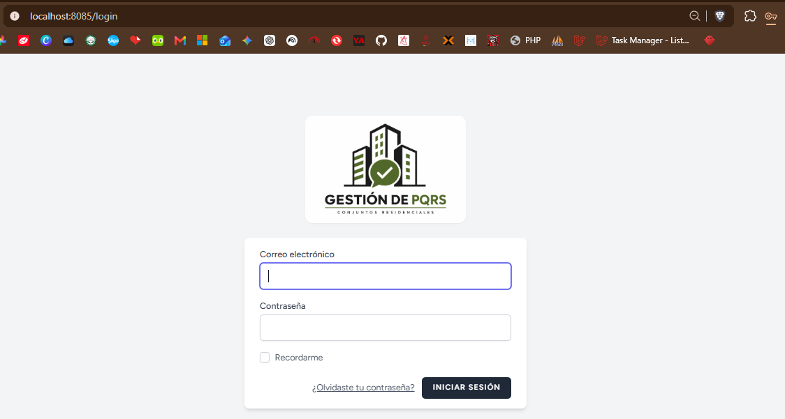
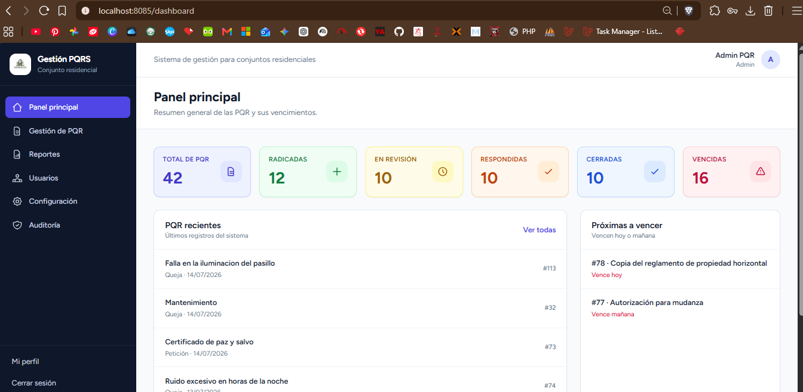
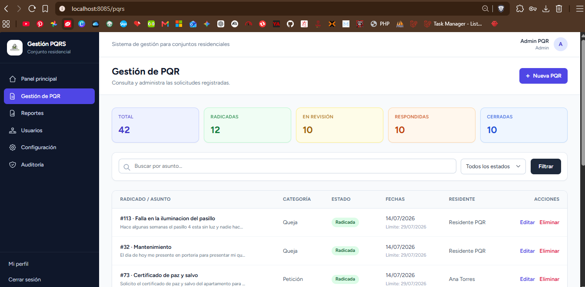
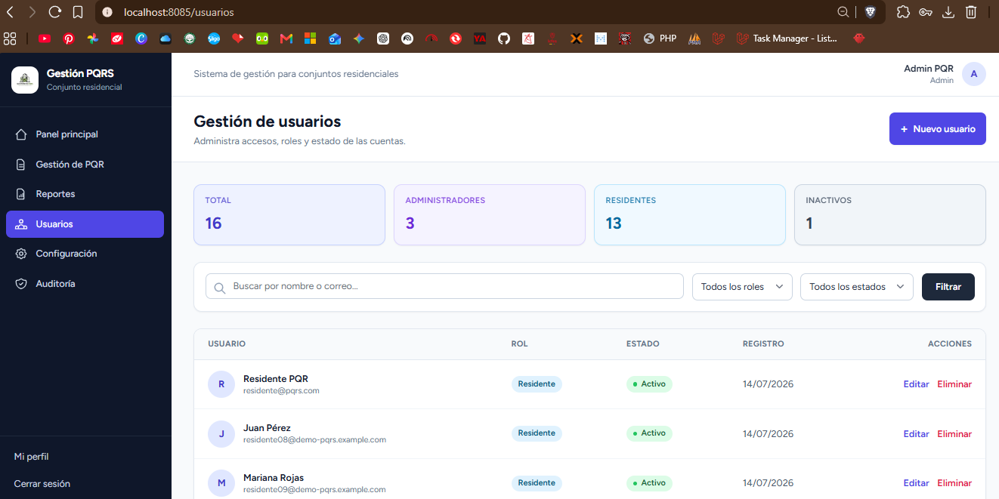
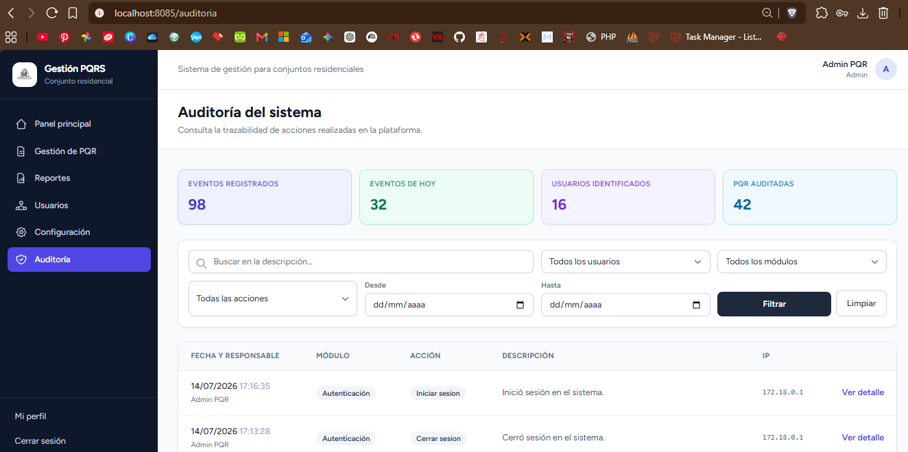
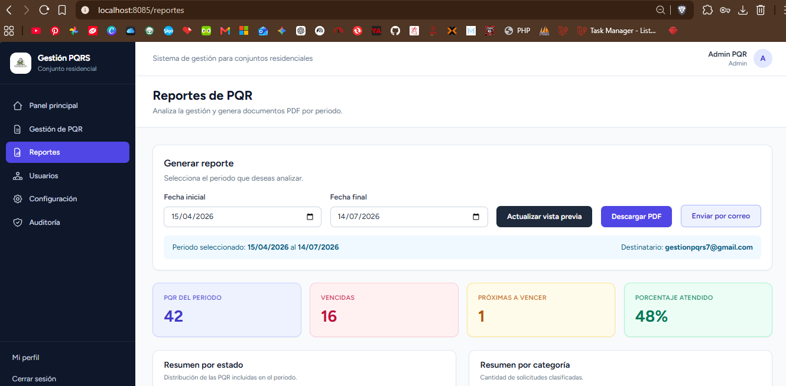
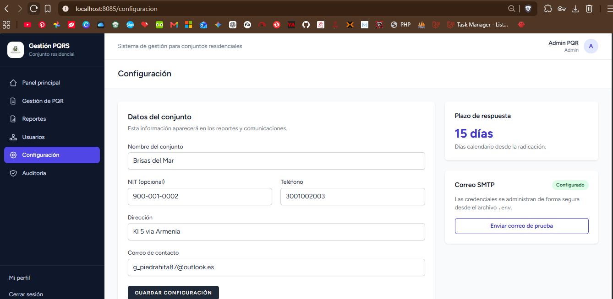

# Gestión de PQRS para Conjuntos Residenciales

Aplicación web para registrar y gestionar peticiones, quejas, reclamos, sugerencias y solicitudes (PQRS) de un conjunto residencial. El proyecto está construido con Laravel 13 y ofrece una interfaz web con control de acceso, reportes, auditoría, notificaciones y una API REST protegida con JWT.

> La versión de despliegue se encuentra en la rama `feature/api-rest`. Si Render está conectado al repositorio, debe apuntar a esa rama y no a `main`.

## Funcionalidades implementadas

- Registro, inicio y cierre de sesión, recuperación de contraseña, actualización de perfil y verificación de correo.
- Segundo factor de autenticación (OTP) para el acceso web.
- Código OTP fijo opcional para una revisión académica, configurado exclusivamente mediante una variable de entorno.
- Roles `admin` y `residente`, cuentas activas/inactivas y restricciones por rol.
- Registro, consulta, búsqueda y filtrado de PQRS.
- Flujo de atención con estados, respuesta administrativa e historial de cambios.
- Administración de usuarios y categorías de PQRS.
- Panel con indicadores, vencimientos y actividad reciente.
- Auditoría de operaciones relevantes sin almacenar contraseñas.
- Notificaciones por correo por cambios de estado y vencimientos.
- Reportes PDF descargables o enviables por correo.
- API REST con autenticación JWT.
- Contenedor Docker listo para Render con PostgreSQL, Nginx y PHP-FPM.

## Tecnologías

- PHP 8.4 en producción (PHP 8.3 o superior para desarrollo)
- Laravel 13
- PostgreSQL en Render y MySQL 8.4 en Laravel Sail local
- Blade, Tailwind CSS, Alpine.js y Vite
- Docker, Nginx y PHP-FPM
- Resend o SMTP para correo
- `tymon/jwt-auth` para la API REST
- `barryvdh/laravel-dompdf` para reportes PDF

## Roles y permisos

| Acción | Administrador | Residente |
|---|:---:|:---:|
| Crear y consultar PQRS | Sí | Sí, solo las propias |
| Gestionar el flujo y responder PQRS | Sí | No |
| Eliminar PQRS | Sí | No |
| Gestionar usuarios y categorías | Sí | No |
| Consultar auditoría y reportes | Sí | No |
| Actualizar datos del conjunto y probar correo | Sí | No |

Las políticas de Laravel impiden que un residente consulte recursos de otros usuarios. Un administrador tampoco puede desactivar, cambiar el rol ni eliminar su propia cuenta administrativa.

## Flujo de las PQRS

Los estados disponibles son:

`radicada` → `en_revision` → `en_proceso` → `resuelta` → `cerrada`

También existen las rutas alternativas `en_revision` → `rechazada`, `rechazada` → `en_revision`, `en_proceso` → `en_espera` y `en_espera` → `en_proceso`. La respuesta administrativa se registra desde `en_proceso` y lleva la PQRS a `resuelta`.

La fecha límite se calcula usando el plazo configurado en el sistema, que por defecto es de 15 días calendario. El dashboard y los reportes resaltan las PQRS vencidas o próximas a vencer.

## Ejecución local con Laravel Sail

### Requisitos

- Docker Desktop con Docker Compose
- Git
- Composer

### Instalación

```bash
git clone https://github.com/Gustavo-87/Task-manager-gestion-pqrs.git
cd Task-manager-gestion-pqrs
git switch feature/api-rest
composer install
cp .env.example .env
./vendor/bin/sail up -d
./vendor/bin/sail artisan key:generate
./vendor/bin/sail artisan migrate:fresh --seed
./vendor/bin/sail npm install
./vendor/bin/sail npm run build
```

La aplicación estará disponible en [http://localhost:8085](http://localhost:8085).

La configuración local incluida usa MySQL dentro de Sail:

```dotenv
APP_URL=http://localhost:8085
APP_PORT=8085
DB_CONNECTION=mysql
DB_HOST=mysql
DB_PORT=3306
DB_DATABASE=laravel
DB_USERNAME=sail
DB_PASSWORD=password
```

Para detener el entorno:

```bash
./vendor/bin/sail down
```

## Datos de demostración

El seeder principal carga datos académicos de demostración, incluidas categorías, usuarios, PQRS, historial y auditoría.

```bash
./vendor/bin/sail artisan migrate:fresh --seed
```

También se pueden cargar o retirar datos de demostración sin recrear toda la base:

```bash
./vendor/bin/sail artisan demo:seed
./vendor/bin/sail artisan demo:clear
```

El comando de carga informa en consola las credenciales de demostración. Estas cuentas y contraseñas son exclusivamente para desarrollo o presentación; deben reemplazarse antes de un uso real.

## Autenticación OTP y modo de jurado

En condiciones normales, el inicio de sesión web genera un OTP de seis dígitos y lo envía al correo del usuario. El código expira según la lógica del modelo de usuario.

Para una presentación, se puede habilitar un código fijo sin enviarlo por correo. **No se debe registrar el valor real en GitHub ni en el archivo `.env.example`.** En Render se configura:

```dotenv
AUTH_FIXED_OTP_CODE=<clave-entregada-al-jurado>
AUTH_OTP_BYPASS_RESIDENT=false
```

Al definir `AUTH_FIXED_OTP_CODE`:

- La pantalla de verificación muestra el modo de demostración.
- No se envía un correo OTP.
- El código configurado permite terminar el segundo factor para los usuarios que llegan a la verificación.

`AUTH_OTP_BYPASS_RESIDENT` es una opción anterior que permite a los residentes entrar sin OTP. Para exigir el código fijo durante la revisión debe estar en `false` o eliminarse de Render. Al finalizar la presentación, se recomienda eliminar `AUTH_FIXED_OTP_CODE` y conservar el OTP normal por correo.

## Correo y recordatorios

El sistema registra notificaciones por cambios de estado, recordatorios de vencimiento, pruebas de correo y envíos de reportes. El planificador ejecuta el proceso de recordatorios todos los días a las 08:00 en la zona horaria `America/Bogota`.

Para ejecutarlo manualmente en local:

```bash
./vendor/bin/sail artisan pqrs:notify-deadlines
```

El correo puede configurarse con SMTP o con Resend. Para Resend se requieren, como mínimo:

```dotenv
MAIL_MAILER=resend
RESEND_API_KEY=<api-key-de-resend>
MAIL_FROM_ADDRESS=<remitente-verificado>
MAIL_FROM_NAME="Gestión PQRS"
```

## Reportes y configuración

Los administradores pueden establecer el nombre, NIT, dirección, teléfono y correo del conjunto residencial. Esta información se utiliza en los reportes PDF y comunicaciones.

El módulo de reportes permite filtrar por rango de fechas, visualizar indicadores, descargar un PDF y enviarlo al correo del administrador autenticado. Las acciones quedan registradas en auditoría.

## API REST

La API se expone bajo el prefijo `/api` y usa tokens JWT. La autenticación de la API es independiente del OTP usado por la interfaz web.

| Método | Ruta | Descripción |
|---|---|---|
| `POST` | `/api/register` | Registra un residente y devuelve un token JWT. |
| `POST` | `/api/login` | Inicia sesión y devuelve un token JWT. |
| `GET` | `/api/me` | Devuelve el usuario autenticado. |
| `POST` | `/api/logout` | Invalida el token actual. |
| `GET` | `/api/pqrs` | Lista las PQRS permitidas para el usuario. |
| `POST` | `/api/pqrs` | Crea una PQRS. |
| `GET` | `/api/pqrs/{id}` | Consulta una PQRS. |
| `PUT/PATCH` | `/api/pqrs/{id}` | Actualiza el estado, sujeto al flujo y permisos. |
| `DELETE` | `/api/pqrs/{id}` | Elimina una PQRS, solo administrador. |
| `PATCH` | `/api/pqrs/{id}/workflow` | Ejecuta una transición mediante una acción del flujo. |

Las rutas protegidas requieren:

```http
Authorization: Bearer <token>
Accept: application/json
```

Para usar JWT se debe definir un secreto en el entorno:

```bash
php artisan jwt:secret
```

En Render se puede generar el secreto en un entorno local seguro y copiar el valor resultante como `JWT_SECRET`.

## Despliegue paso a paso en Render

El repositorio incluye `Dockerfile`, `entrypoint.sh` y `nginx.conf`. El contenedor instala las dependencias, compila los recursos Vite, ejecuta migraciones, prepara cachés y publica la aplicación en el puerto que Render asigne.

### 1. Publicar la rama correcta

Confirma que el código actualizado esté en GitHub en la rama `feature/api-rest`:

```bash
git switch feature/api-rest
git pull origin feature/api-rest
git push origin feature/api-rest
```

### 2. Crear la base de datos PostgreSQL

En Render, crea un servicio **PostgreSQL**. Copia su *Internal Database URL*; se usará como `DB_URL` en el servicio web.

### 3. Crear el servicio web

1. En Render selecciona **New + → Web Service**.
2. Conecta el repositorio `Gustavo-87/Task-manager-gestion-pqrs`.
3. Selecciona la rama **`feature/api-rest`**.
4. Usa el entorno **Docker** para que Render construya el `Dockerfile` del repositorio.
5. No establezcas comandos de compilación o inicio alternativos: el `Dockerfile` y `entrypoint.sh` se encargan de ello.
6. Guarda y crea el servicio.

### 4. Configurar las variables de entorno

En **Environment** del servicio web agrega las siguientes variables. Nunca subas valores secretos al repositorio.

| Variable | Valor o propósito |
|---|---|
| `APP_ENV` | `production` |
| `APP_DEBUG` | `false` |
| `APP_URL` | URL pública asignada por Render, por ejemplo `https://tu-servicio.onrender.com` |
| `APP_KEY` | Clave Laravel única: `base64:` seguida de 32 bytes codificados en Base64 |
| `APP_TIMEZONE` | `America/Bogota` |
| `DB_CONNECTION` | `pgsql` |
| `DB_URL` | Internal Database URL de PostgreSQL en Render |
| `DB_SSLMODE` | `require` si la conexión lo necesita |
| `SESSION_DRIVER` | `database` |
| `CACHE_STORE` | `database` |
| `QUEUE_CONNECTION` | `database` |
| `JWT_SECRET` | Secreto generado con `php artisan jwt:secret` |
| `MAIL_MAILER` | `resend` o `smtp` |
| `RESEND_API_KEY` | Solo cuando se usa Resend |
| `MAIL_FROM_ADDRESS` | Remitente validado por el proveedor de correo |
| `MAIL_FROM_NAME` | Nombre mostrado en los correos |
| `SEED_DEMO_DATA` | `true` para crear cuentas y PQRS de presentación; `false` para omitirlas |
| `DEMO_PASSWORD` | Contraseña de las cuentas creadas por el seeder de Render cuando `SEED_DEMO_DATA=true` |
| `AUTH_FIXED_OTP_CODE` | Opcional: código fijo temporal para jurado; eliminar después de la revisión |
| `AUTH_OTP_BYPASS_RESIDENT` | `false` si se va a solicitar el OTP fijo a residentes |

Para generar `APP_KEY` fuera del repositorio puedes ejecutar en un entorno seguro:

```bash
php -r "echo 'base64:'.base64_encode(random_bytes(32)).PHP_EOL;"
```

### 5. Realizar el primer despliegue

Al guardar las variables, usa **Manual Deploy → Deploy latest commit** si Render no inicia el despliegue automáticamente. Durante el arranque el contenedor:

1. Ejecuta `php artisan migrate --force`.
2. Si `SEED_DEMO_DATA=true`, ejecuta `RenderDemoSeeder`.
3. Limpia y crea las cachés de Laravel.
4. Crea el enlace de almacenamiento cuando aplica.
5. Inicia PHP-FPM y Nginx en el puerto entregado por Render.

Revisa los logs hasta ver que Nginx está escuchando en el puerto configurado. Después abre la URL pública y prueba el inicio de sesión, la creación de una PQRS y el acceso a las páginas administrativas.

### 6. Actualizaciones posteriores

Cada `push` a `feature/api-rest` dispara un nuevo despliegue si *Auto-Deploy* está habilitado. Para cambios de variables de entorno, guarda la modificación en Render y ejecuta un redeploy. Como el arranque ejecuta migraciones, las nuevas migraciones se aplicarán durante el siguiente despliegue.

## Pruebas

La suite incluye pruebas de autenticación, perfiles, PQRS, usuarios, auditoría, configuración, notificaciones y reportes.

```bash
./vendor/bin/sail artisan test
```

## Evidencias

### Inicio de sesión



### Dashboard



### Gestión de PQRS



### Gestión de usuarios



### Auditoría



### Reportes



### Configuración


